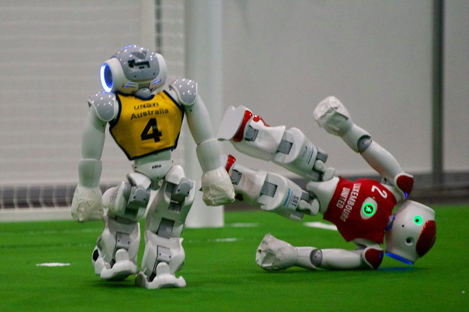
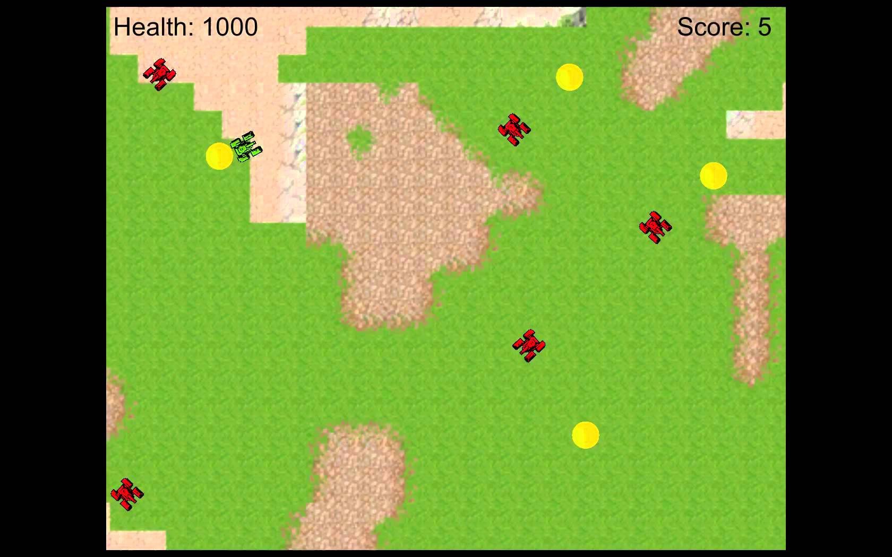
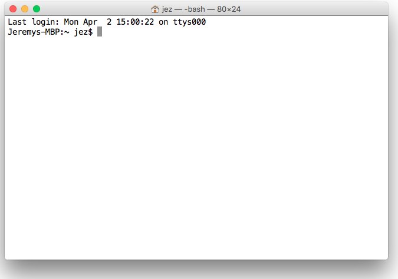
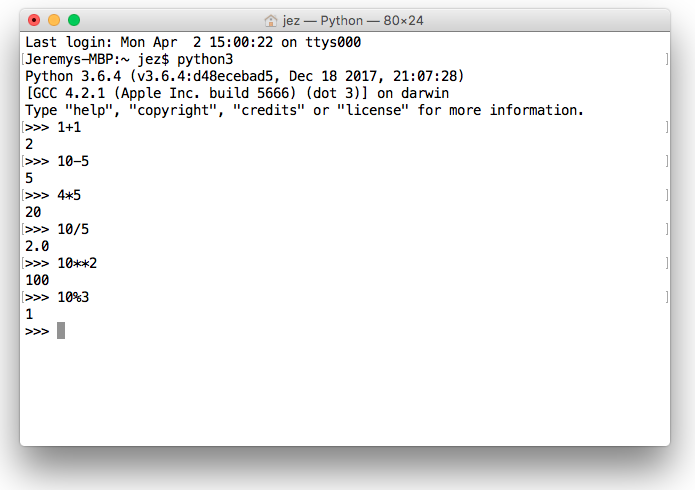
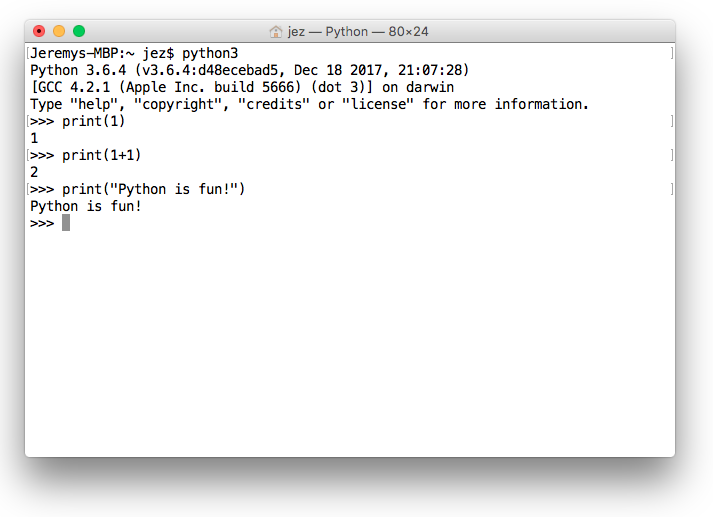
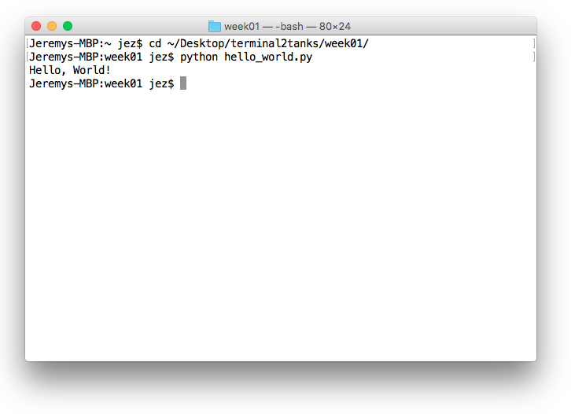
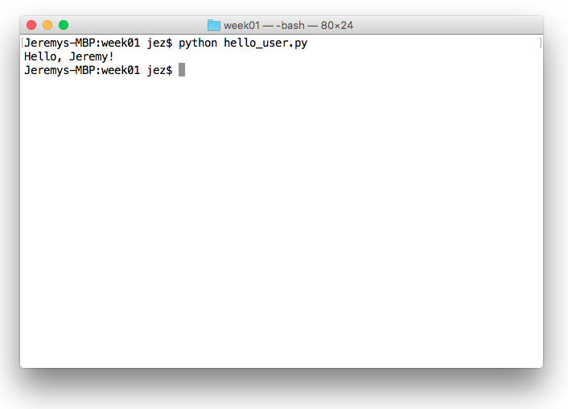

class: center, middle

# Week 01 - Hello, World!
---

## Introduction
### Who am I?
* I grew up in Maianbar
* I studied Computer Science at UNE / UNSW
* I was on the UNSW RoboCup team (rUNSWift)
* I interned at Dolby / Microsoft
---

### rUNSWift scoring a goal

---

### Who are you?
* Please introduce yourselves!
---

### The course
* 12 weeks, one hour-long workshop per week
* Focus on coding, less emphasis on reading
* Need-to-know learning
* Informal setting - ask questions anytime!
* We will learn the fundamentals of coding in Python
* And game development in Pygame
* We will make a 2D 'Tanks' game!
---

### An example 'Tanks' game

---

### Why should I be a programmer?
* It's fun!
* A creative outlet
* An important profession
* Great salaries
---

### What is programming?
* Writing a program
* A program is "A structured collection of instruction sequences that perform a specific task when executed by a computer" [1]
* Written in a programming language.
* Popular programming languages: Python, C/C++, Java, C#, Javascript
---

### What is Python?
* An "Interpreted high-level programming language" [2]
* Great for beginners
* Forgiving, simple, powerful
---

## Getting Started
### Installing Python3 and Sublime Text
* Python3: http://python.org/downloads
* Sublime Text: https://www.sublimetext.com/3
---

### The terminal
* The terminal is the commandline of your computer
* It allows you to call the Python interpreter and execute programs
* To open a terminal on Windows, open the Start menu and search for 'cmd'. Open it
* To open a terminal on Mac OSX, click the search button and search for 'terminal'. Open it
---

### The terminal on OSX

---

### The Python interpreter
* Interprets and executes commands on-the-fly
* You can access the interpreter by opening a terminal, typing `python3`, and pressing enter
* You can execute a command in the interpreter by typing the command and pressing enter
* Try executing these commands in the interpreter:
    - `1+1`
    - `10-5`
    - `4*5`
    - `10/5`
    - `10**2`
    - `10%3`
---

### Calculations

---

### The `print()` command
* Used to 'print' something to the screen
* Try typing these commands in the interpreter:
    - `print(1)`
    - `print(1+1)`
    - `print("Python is fun!")`
---

### Print examples

---

## Your First Program
### Creating the program
* On your desktop, create a folder called 'terminal2tanks'
* Inside this folder, create a folder called 'week01'
* Open Sublime Text, and save a file called 'hello_world.py' in the 'week01' folder
* In 'hello_world.py', type the following:
```python
print("Hello, World!")
```
* Save the file
---

### Executing the program
* Open a terminal
* If you're using Mac OSX:
    - Type `cd ~/Desktop/terminal2tanks/week01` in the terminal and press enter
* If you're using Windows:
    - Type `cd /d %UserProfile%\Desktop\terminal2tanks\week01` in the terminal and press enter
* Type `python3 hello_world.py` and press enter
---

### `hello_world.py` in action

---

### Congratulations!
* You've written your first program!
---

### Hello, `[user]`!
* Create a new file in the `week01` folder, called `hello_user.py`.
* Instead of printing `Hello, World!`, write a program that prints `Hello, [user]!`, where `user` is your name.
* For example, my program would print `Hello, Jeremy!`
* Execute the program with the command `python3 hello_user.py`
---

### `hello_user.py` in action

---

## Extension: `hello_global.py`
* Create a new file in the `week01` folder, called `hello_global.py`.
* Print `Hello` in the following languages:
    - English
    - Japanese
    - French
    - Spanish
    - German
    - Italian
    - Portuguese
    - Hindi
    - Persian
    - Russian
* For each greeting, include the language beforehand. For example, the program should print `English: Hello` for English.
---

## That's all, folks!
* You've finished the first workshop.
---

## Footnotes
1. https://en.wikipedia.org/wiki/Computer_program
2. https://en.wikipedia.org/wiki/Python_(programming_language)
