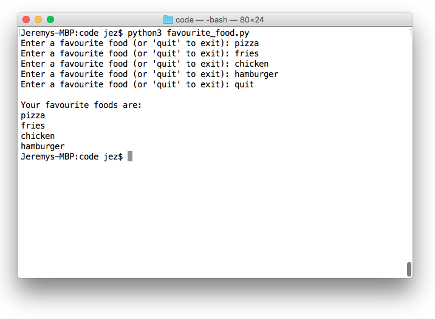

class: center, middle

# Week 04 - Lists and tuples
---

## Last Week's Challenge
### `multiple_printer.py`
```python
divisor = int(input('divisor: '))

for i in range(100):
    if (i % divisor == 0):
        print(i)
```
---

## Lists
* A list is an ordered collection of values.
* It is contains elements / items / members.
* It is useful when we want to keep track of a _list_ of things.
* For example:

```python
students = ['Isaac', 'Trent', 'Colt']
print(students)
```

* The types of members can be mixed.
* For example:

```python
numbers = ['Ten', 10, 10/1]
```
---

### Accessing members
* We can access the members of a list in a number of ways.
* The first way is by using the _index_ operator, `[]`.
* Note that the 0th index is the FIRST member, and length-1 is the last member.
* For example:

```python
students = ['Isaac', 'Trent', 'Colt']
print(students)
print(students[0])
print(students[1])
print(students[2])
```

* We can also change members of a list the same way:

```python
students[0] = 'Darcy'
print(students)
```

* What would `print(students[3])` do? Why?
---

### Accessing members using a `for` loop
* Another way we can access members is by using a `for` loop.
* For example:

```python
students = ['Isaac', 'Trent', 'Colt']
for s in students:
    print(s)
```
---

### The `len` command
* We can find the length of data in python by using the `len` command.
* For example:

```python
greeting = 'Hello, world'
print(len(greeting))

greeting_list = ['Hello', 'world']
print(len(greeting_list))

students = ['Isaac', 'Trent', 'Colt']
print(students[len(students)-1])
```

* What would `print(students[len(students)])` do? Why?
---

### List operations
* We can do many operations with lists.
* Look at the following examples:

```python
students = ['Isaac', 'Trent', 'Colt']
students.append('Darcy')
print(students)
students.sort()
print(students)
students.remove('Darcy')
print(students)

cars = ['Toyota', 'Ford', 'Holden']
bikes = ['Yamaha', 'Kawasaki']
vehicles = cars + bikes
print(vehicles)
```
---

### Checking for membership
* We can check if a list contains a member by using the `in` conditional.
* For example:

```python
students = ['Isaac', 'Trent', 'Colt']
if 'Isaac' in students:
    print('Found Isaac!')
else:
    print('Could not find Isaac!')

if 'Darcy' in students:
    print('Found Darcy!')
else:
    print('Could not find Darcy!')
```

* We can also use the `in` conditional for strings.
* For example:

```python
while True:
    word = input('Enter a word with the letter \'b\': ') 
    if 'b' not in word:
        print('You failed!')
        break   # the break command exits a while loop
```
---

## Tuples
* Tuples are similar to lists, but they use regular parentheses, `(` and `)`, instead of the square brackets, `[` and `]`. 
* Once they are created, a member cannot be re-assigned!
* For example:

```python
students = ('Isaac', 'Trent', 'Colt')
students[0] = 'Darcy' # error!
```

* This is the error we get:

```python
Traceback (most recent call last):
  File "<stdin>", line 1, in <module>
TypeError: 'tuple' object does not support item assignment
```

* Instead, we have to do:

```python
students = ('Isaac', 'Trent', 'Colt')
students = ('Darcy', students[1], students[2])
print(students)
```
---

## Challenge: `favourite_foods.py`
Write a program that behaves as follows:
* Prompt the user to enter one of their favourite foods
* Add the food to a list, and repeat (ask the user for another favourite)
* If the user entered 'quit' as their food, do not add it to the list. Print the list of their favourite foods and exit.
---
### Example input / output


---

## That's all, folks!
* You've finished the fourth workshop!